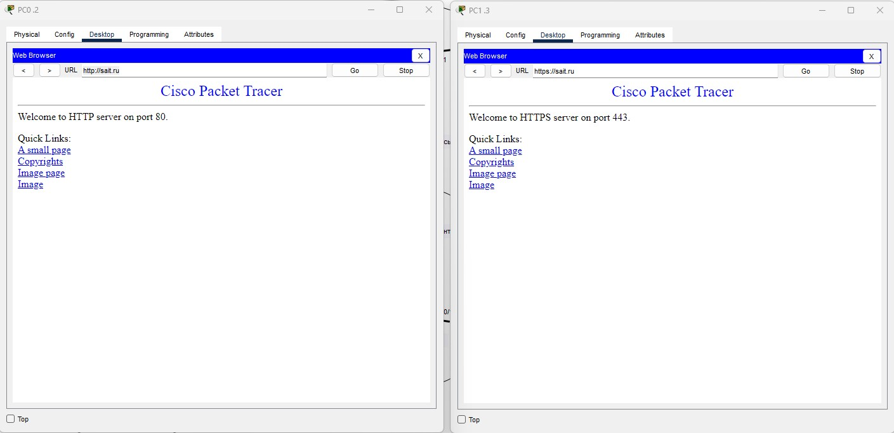
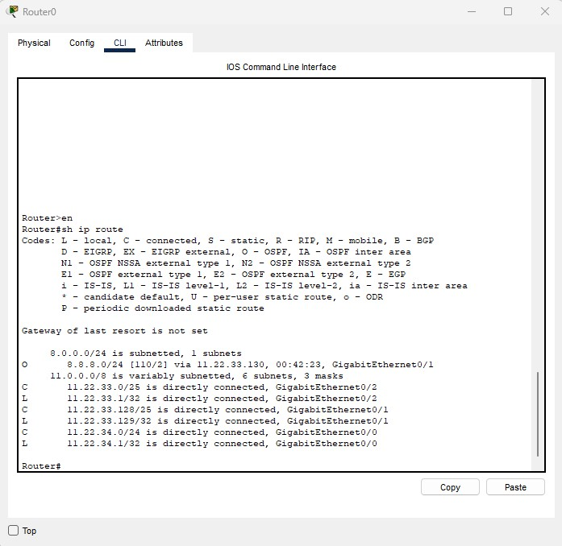

# Computer-networks-8
Компьютерные сети (семинары) Урок 8. Основы HTTP/HTTPS и DNS  

Настроить сеть согласно информации на схеме.  

— Сымитировать "Интернет" с помощью OSPF. Приватных сетей в маршрутизации быть не должно. 
— Для компьютеров из Office 1 предоставить доступ в "Интернет" с помощью PAT. 
— Открыть доступ из "Интернета" к серверам из Office 2 c помощью Port Forwarding. 
— Для компьютеров из Office 1 должны открываться разные сайты по HTTP и HTTPS из Office 2 по одному доменному имени.  

Предоставить скриншоты открытых разных сайтов по одному доменному имени. 

Предоставить скриншот таблицы NAT трансляций с Router3. 

Предоставить скриншот таблицы маршрутизации с Router0. 

